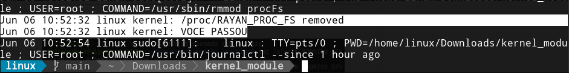

# Kernel Module Proc File System

This is a kernel module that creates a proc file system in the Linux kernel. This README file provides instructions on how to build and use the module.

## Table of Contents

- [Prerequisites](#prerequisites)
- [Building the Module](#building-the-module)
- [Loading the Module](#loading-the-module)
- [Unloading the Module](#unloading-the-module)
- [Example Image](#example-image)
- [License](#license)

## Prerequisites

- Linux kernel headers and development tools must be installed on your system.

## Building the Module

1. Clone the repository or download the source code for the module.
2. Change to the module's directory: `cd kernel_module`.
3. Build the module using the provided Makefile: `make`.

## Loading the Module

To load the module into the kernel:

1. Make sure you have the necessary permissions (e.g., use `sudo`).
2. Run the following command: `insmod procFs.ko`.

## Unloading the Module

To unload the module from the kernel:

1. Make sure you have the necessary permissions (e.g., use `sudo`).
2. Run the following command: `rmmod procFs`.

## Example Image

Below is an example image demonstrating the module's functionality:

## License

This module is released under the [MIT License](LICENSE).

Feel free to modify and distribute the code according to the terms of the license.

Please note that this is just a template, and you should modify it according to the specifics of your kernel module proc file system. Additionally, you will need to provide your own example image that demonstrates the functionality of your module.

Author: [RayHakku](https://github.com/RayHakku) 👩‍💻
